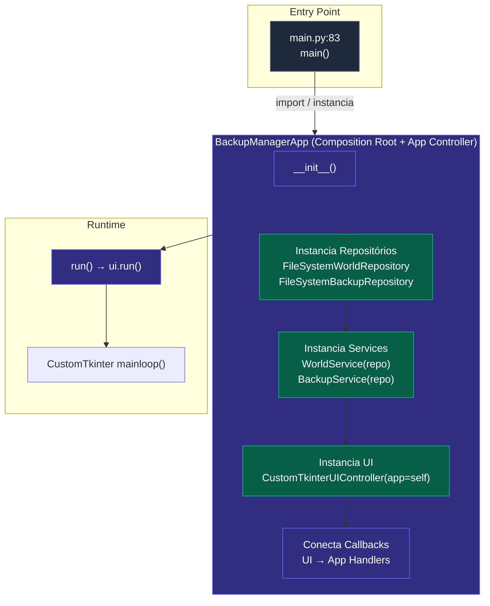
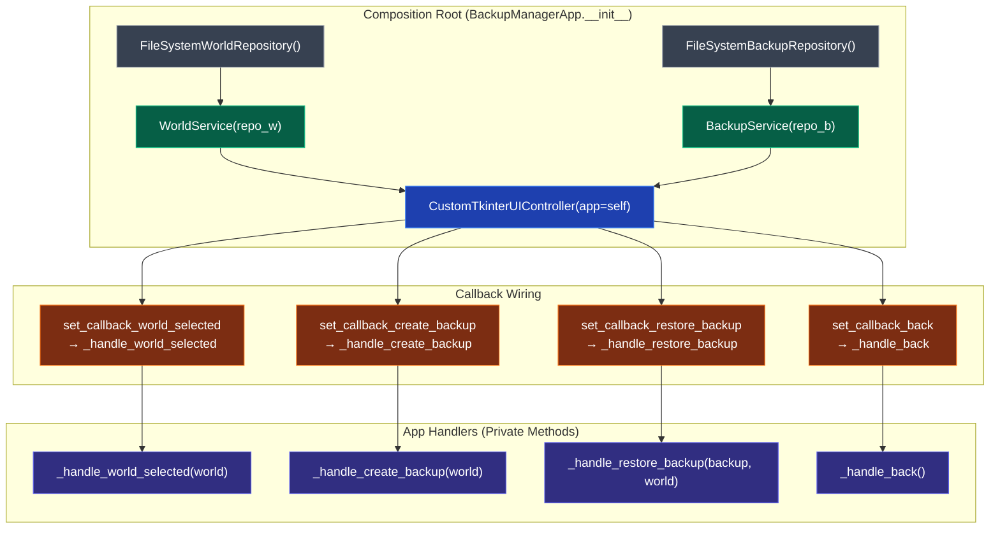

# Injeção de Dependência (Composition Root)

Como o `BackupManagerApp` monta a aplicação: instancia repositórios, injeta em services, injeta na UI e conecta callbacks.

---

## 🎯 Visão Geral

O `BackupManagerApp` atua como **Composition Root** e **Application Controller**:



---

## 🔧 Código: main.py (Entry Point)

```python
# main.py:66-83
def main():
    """Função principal - ponto de entrada da aplicação."""
    try:
        _configure_logging()
        logger = logging.getLogger(__name__)

        logger.info("=== Backup Manager Iniciando ===")
        logger.info(f"Log registrado em: {LOG_FILE}")

        app = BackupManagerApp()  # Composition Root
        app.run()                 # Inicia App Controller
    except Exception as e:
        logger.critical(f"Erro crítico ao iniciar: {e}", exc_info=True)


if __name__ == "__main__":
    main()
```

**Responsabilidades do `main.py`:**
1. Configura logging
2. **Instancia o `BackupManagerApp`** (Composition Root)
3. Chama `app.run()` para iniciar o loop

---

## 🏗️ BackupManagerApp.__init__() — Composition Root

```python
# application.py:43-56
def __init__(self):
    """Inicializa a aplicação com serviços e UI."""
    # 1. Instancia Repositórios (Infrastructure)
    self.world_service = WorldService(FileSystemWorldRepository())
    self.backup_service = BackupService(FileSystemBackupRepository())

    # 2. Instancia UI (Adapter)
    self.ui = CustomTkinterUIController(app=self)

    # 3. Conecta Callbacks (UI → App Handlers)
    self.ui.set_callback_world_selected(self._handle_world_selected)
    self.ui.set_callback_create_backup(self._handle_create_backup)
    self.ui.set_callback_restore_backup(self._handle_restore_backup)
    self.ui.set_callback_back(self._handle_back)

    # 4. Estado
    self.current_world: WorldModel | None = None
```

### O que acontece aqui:

| Passo | Código | Padrão |
|-------|--------|--------|
| **1. Repositories** | `FileSystemWorldRepository()` | Instancia adapters concretos |
| **2. Services** | `WorldService(repo)` | Injeta Port no Service (DI manual) |
| **3. UI** | `CustomTkinterUIController(app=self)` | Injeta App Controller na UI (callback registry) |
| **4. Callbacks** | `ui.set_callback_*(self._handle_*)` | Wiring: UI → App Handlers |

---

## 🔄 Injeção de Dependência Manual (DI)

### Service ← Port

```python
# application.py:45-46
self.world_service = WorldService(FileSystemWorldRepository())
self.backup_service = BackupService(FileSystemBackupRepository())
```

**WorldService** recebe `WorldRepositoryPort` (interface):
```python
# world_service.py:34-36
def __init__(self, repository: WorldRepositoryPort):
    self.repository = repository
```

### UI ← App Controller

```python
# application.py:47
self.ui = CustomTkinterUIController(app=self)
```

**UIController** recebe `app` para registrar callbacks:
```python
# customtkinter_ui.py:89-93
def __init__(self, app=None):
    self.app = app
    # ...
```

### Callback Registry (UI → App)

```python
# application.py:50-53
self.ui.set_callback_world_selected(self._handle_world_selected)
self.ui.set_callback_create_backup(self._handle_create_backup)
self.ui.set_callback_restore_backup(self._handle_restore_backup)
self.ui.set_callback_back(self._handle_back)
```

**UIController** expõe setters para callbacks:
```python
# customtkinter_ui.py:440-456
def set_callback_world_selected(self, callback: Callable[[WorldModel], None]) -> None:
    self._callback_world_selected = callback

def set_callback_create_backup(self, callback: Callable[[WorldModel], None]) -> None:
    self._callback_create_backup = callback

def set_callback_restore_backup(self, callback: Callable[[BackupModel, WorldModel], None]) -> None:
    self._callback_restore_backup = callback

def set_callback_back(self, callback: Callable[[], None]) -> None:
    self._callback_back = callback
```

---

## 🔗 Wiring Completo (Diagrama)



---

## 🧵 Thread Management (App Controller)

O `BackupManagerApp` gerencia threads para operações longas:

```python
# application.py:160 - Backup
thread = threading.Thread(target=run_backup, daemon=True)
thread.start()

# application.py:218 - Restore
thread = threading.Thread(target=run_restore, daemon=True)
thread.start()
```

**Padrão:**
- Operações longas (backup/restore) → **Background Thread** (`daemon=True`)
- Progress updates → `main_window.after(0, callback)` → **Main Thread (UI)**
- Thread-safe via `main_window.after(0, callback)`

---

## 📦 Resumo da DI

| Dependência | Tipo | Injetado Em | Via |
|-------------|------|-------------|-----|
| `WorldRepositoryPort` | Interface | `WorldService` | Construtor |
| `BackupRepositoryPort` | Interface | `BackupService` | Construtor |
| `WorldService` | Concreto | `BackupManagerApp` | Atributo |
| `BackupService` | Concreto | `BackupManagerApp` | Atributo |
| `BackupManagerApp` | Concreto | `CustomTkinterUIController` | Construtor (`app=self`) |
| `_handle_*` | Methods | `UIController` | Setters (`set_callback_*`) |

---

## 🎯 Por que DI Manual (sem framework)?

| Vantagem | Explicação |
|----------|------------|
| **Zero dependências** | Não precisa de `injector`, `dependency-injector`, etc. |
| **Explícito** | Fluxo de dependências visível no código |
| **Testável** | Fácil mock: `WorldService(MockWorldRepo())` |
| **Simples** | 45 linhas em `__init__`, fácil de entender |
| **Pythonico** | `__init__` é o local natural para DI em Python |

---

## 🧪 Testabilidade

```python
# Teste unitário - mock do repositório
class MockWorldRepo(WorldRepositoryPort):
    def list_directory(self, path): return [Path("fake_world")]
    def read_text_file(self, path): return "Mundo Teste"
    # ... outros métodos

# Instancia service com mock
world_service = WorldService(MockWorldRepo())
worlds = world_service.list_worlds()  # Rápido, sem FS real
```

---

## 📚 Referências

- [Código: main.py](https://github.com/DandanLeinad/minecraft-bedrock-backup-manager/blob/main/src/backup_manager_mvp/main.py) — Entry Point
- [Código: application.py](https://github.com/DandanLeinad/minecraft-bedrock-backup-manager/blob/main/src/backup_manager_mvp/application.py) — Composition Root + App Controller
- [Código: world_service.py](https://github.com/DandanLeinad/minecraft-bedrock-backup-manager/blob/main/src/backup_manager_mvp/core/services/world_service.py) — Service com Port
- [Código: customtkinter_ui.py](https://github.com/DandanLeinad/minecraft-bedrock-backup-manager/blob/main/src/backup_manager_mvp/ui/customtkinter/customtkinter_ui.py) — UI com Callback Registry
- [Request Flow](./request-flow.md) — Como as requisições percorrem o sistema
- [Request Flow - Threading](./request-flow.md#3-threading-model) — Threading Model
