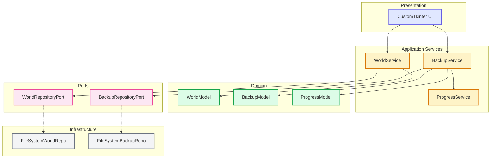

# Arquitetura

Visão técnica da arquitetura do projeto: Ports & Adapters (Hexagonal), Domain Models, Services, e Infrastructure.

---

## 🎯 Visão Geral

O projeto segue **Arquitetura Hexagonal (Ports & Adapters)** com separação clara entre:

<div class="grid cards" markdown>

-   :material-database:{ .lg .middle } **Domain Models**

    Entidades puras (Pydantic): WorldModel, BackupModel, ProgressModel.

    [:octicons-arrow-right-24: Models](./ports-and-models.md#models-pydantic)

-   :material-api:{ .lg .middle } **Ports (Interfaces)**

    Contratos ABC: WorldRepositoryPort, BackupRepositoryPort.

    [:octicons-arrow-right-24: Ports](./ports-and-models.md#ports-interfacescontratos)

-   :material-cog:{ .lg .middle } **Services**

    Lógica de negócio: WorldService, BackupService, ProgressService.

    [:octicons-arrow-right-24: Services](../reference/services.md)

-   :material-harddisk:{ .lg .middle } **Infrastructure**

    Implementações FS: FileSystemWorldRepo, FileSystemBackupRepo.

    [:octicons-arrow-right-24: Infra](../reference/ports.md)

</div>

---

## 🏗️ Diagrama de Camadas



---

## 🔑 Padrões Principais

| Padrão | Onde | Benefício |
|--------|------|-----------|
| **Ports & Adapters** | `core/ports` + `infra/repository` | Testável, desacoplado, trocável |
| **Dependency Injection** | Services recebem Port no `__init__` | Fácil mock em testes |
| **Repository Pattern** | Ports abstraem FS | Isola lógica de domínio |
| **Feature Flags** | `config/feature_flags.py` | Integração contínua segura |
| **Progress Callback** | BackupService + UI | UX responsiva em operações longas |

---

## 📁 Estrutura de Pastas (src)

```
src/backup_manager_mvp/
├── main.py                          # Entry point
├── application.py                   # DI Container
├── config/
│   └── feature_flags.py             # Feature Flags
├── core/
│   ├── models/                      # Domain Models (Pydantic)
│   ├── ports/                       # Interfaces (ABC)
│   └── services/                    # Business Logic
├── infra/
│   └── repository/                  # Port Implementations
└── ui/customtkinter/                # UI Implementation
```

---

## 🔗 Navegação

- [Visão Geral Detalhada](./overview.md) — Fluxos, camadas, tecnologias, pontos de extensão
- [Ports & Models](./ports-and-models.md) — Contratos ABC, Models Pydantic, DI, estrutura runtime
- [Referência: Models](../reference/models.md) — Documentação completa dos Models
- [Referência: Ports](../reference/ports.md) — Documentação completa dos Ports
- [Referência: Services](../reference/services.md) — Documentação completa dos Services
- [ADR 0001](../decisions/0001-python-now-rust-tauri-future.md) — Decisão: Python agora, Rust/Tauri futuro
