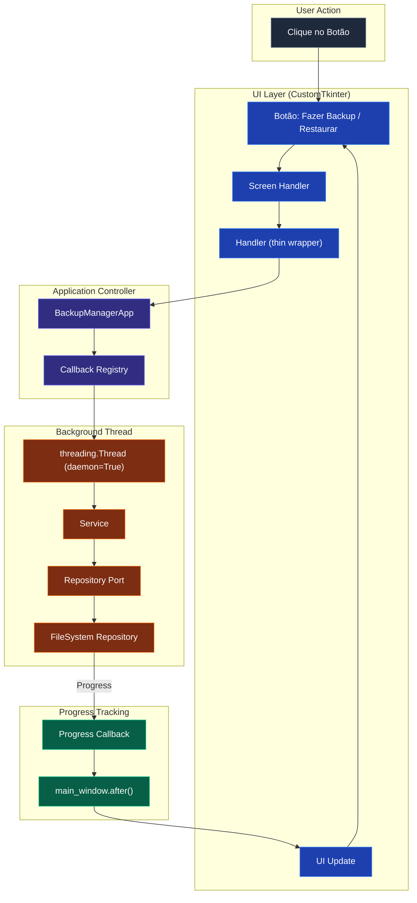
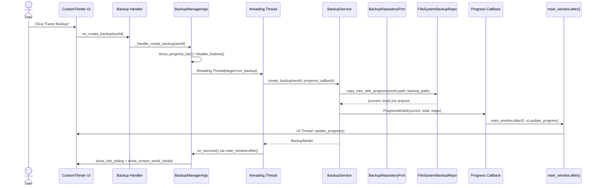
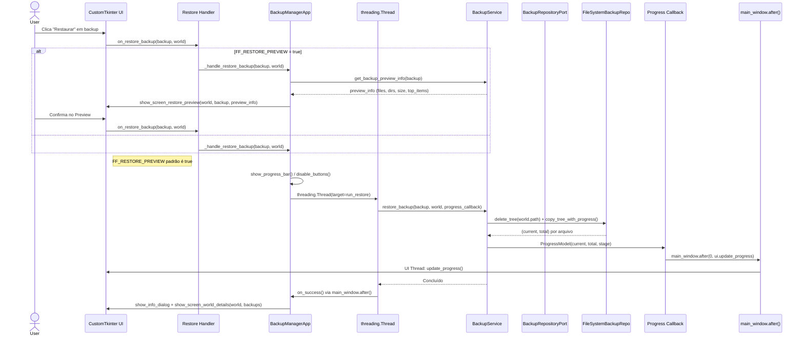
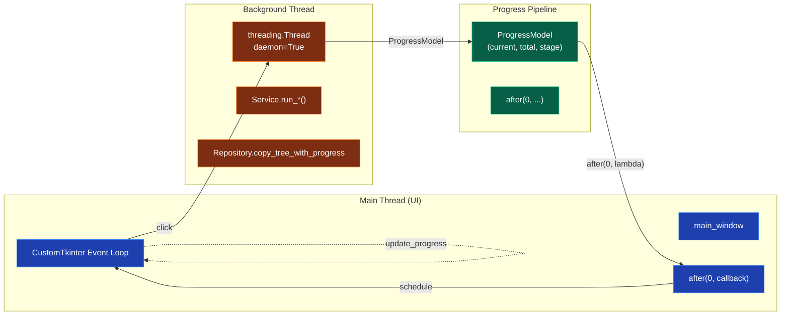

# Fluxo de Requisição

Detalhamento de como as operações de **Backup** e **Restore** percorrem o sistema, incluindo threading, callbacks de progresso e feature flags.

---

## 🎯 Visão Geral

Este documento complementa a [Visão Arquitetural](../index.md#arquitetura-em-resumo) mostrando o fluxo de execução real de uma requisição.



---

## 1️⃣ Backup Flow



### Pontos-Chave

| Etapa | Código | Responsabilidade |
|-------|--------|------------------|
| **Threading** | `application.py:160` | `threading.Thread(target=run_backup, daemon=True)` |
| **Progress** | `backup_service.py:119` | `copy_tree_with_progress()` chama callback `(current, total)` |
| **Thread-Safety** | `application.py:119` | `main_window.after(0, lambda: ui.update_progress(progress))` |
| **Model** | `backup_service.py:143` | Retorna `BackupModel` com `created_at`, `backup_path`, `size_display` |

---

## 2️⃣ Restore Flow (com Feature Flag)



### Branch da Feature Flag

```mermaid
flowchart TD
    RESTORE[Restaurar Clicado] --> FLAG{FF_RESTORE_PREVIEW?}
    FLAG -->|true (padrão)| PREVIEW[show_screen_restore_preview]
    FLAG -->|false| DIRECT[Direct Restore]
    PREVIEW --> CONFIRM{Usuário Confirma?}
    CONFIRM -->|Sim| DIRECT
    CONFIRM -->|Não| CANCEL[Cancelar]
    DIRECT --> THREAD[threading.Thread]
    THREAD --> RESTORE_SVC[BackupService.restore_backup]
    RESTORE_SVC --> REPO[FileSystemBackupRepo]
    REPO --> PROG[Progress Callback]
    PROG --> AFTER[main_window.after]
    AFTER --> UI[UI Update]
```

### Estados da Feature Flag

| Flag | Valor | Comportamento |
|------|-------|---------------|
| `FF_RESTORE_PREVIEW` | `true` (padrão) | Preview → Confirmação → Executa |
| `FF_RESTORE_PREVIEW` | `false` | Restore direto → Confirmação → Executa |

---

## 3️⃣ Threading Model



### Padrão Thread-Safe

```python
# Em BackupManagerApp._handle_create_backup()
def on_progress(progress: ProgressModel) -> None:
    if self.ui.main_window:
        self.ui.main_window.after(0, lambda: self.ui.update_progress(progress))

# Service chama callback vindo do Repository
self.repository.copy_tree_with_progress(
    world.path, backup_path,
    progress_callback=internal_callback  # recebe (current, total)
)
```

### Regras de Ouro

| Regra | Código | Por quê |
|-------|--------|---------|
| **UI só na Main Thread** | `main_window.after(0, ...)` | CustomTkinter/Tkinter não é thread-safe |
| **Background = daemon** | `threading.Thread(daemon=True)` | Não bloqueia encerramento do app |
| **Progress = DTO** | `ProgressModel(current, total, stage)` | Imutável, serializável, thread-safe |
| **Callbacks via after()** | `main_window.after(0, callback)` | Agenda na event loop da UI |

---

## 4️⃣ Feature Flags Flow

```mermaid
flowchart TD
    START[App Inicia] --> LOAD[Carrega feature_flags.py]
    LOAD --> PARSE["os.getenv('FF_*', defaults)"]

    PARSE --> ICON[FF_WORLD_ICON_PREVIEW]
    PARSE --> PREVIEW[FF_RESTORE_PREVIEW]
    PARSE --> MT[FF_MULTI_THREADING]
    PARSE --> LOG[FF_ADVANCED_LOGGING]

    ICON -->|true (padrão)| ICON_ON[World Icon Preview ativo]
    PREVIEW -->|true (padrão)| PREVIEW_ON[Restore com Preview]
    MT -->|true| MT_ON[Threading experimental]
    LOG -->|true| LOG_ON[Debug verbose]

    classDef flag fill:#1e40af,stroke:#3b82f6,color:#fff;
    classDef on fill:#065f46,stroke:#10b981,color:#fff;

    class ICON,PREVIEW,MT,LOG flag;
    class ICON_ON,PREVIEW_ON,MT_ON,LOG_ON on;
```

### Tabela de Flags

| Flag | Env Var | Padrão | Status | Descrição |
|------|---------|--------|--------|-----------|
| World Icon Preview | `FF_WORLD_ICON_PREVIEW` | `true` | ✅ Ativo | Preview de ícone do mundo na lista |
| Restore Preview | `FF_RESTORE_PREVIEW` | `true` | ✅ Ativo | Preview antes de restaurar |
| Multi-threading | `FF_MULTI_THREADING` | `false` | ⚡ Experimental | Operações paralelas |
| Advanced Logging | `FF_ADVANCED_LOGGING` | `false` | ⚡ Experimental | Logs verbosos |

### Uso

```bash
# Desenvolvimento - ativar experimentais
FF_MULTI_THREADING=true FF_ADVANCED_LOGGING=true uv run task dev

# Testes CI - desativar previews se necessário
FF_WORLD_ICON_PREVIEW=false FF_RESTORE_PREVIEW=false uv run task test
```

---

## 5️⃣ Referências de Código

| Fluxo | Arquivo | Função/Classe |
|-------|---------|---------------|
| **Backup** | `application.py:105` | `_handle_create_backup()` |
| **Backup Thread** | `application.py:160` | `threading.Thread(target=run_backup)` |
| **Progress Callback** | `application.py:117` | `on_progress()` + `main_window.after()` |
| **Service Backup** | `backup_service.py:64` | `create_backup()` |
| **Repo Copy** | `backup_repository.py:72` | `copy_tree_with_progress()` |
| **Restore** | `application.py:163` | `_handle_restore_backup()` |
| **Restore Thread** | `application.py:218` | `threading.Thread(target=run_restore)` |
| **Feature Flag** | `feature_flags.py` | `FEATURE_FLAGS.ENABLE_RESTORE_PREVIEW` |
| **Preview** | `backup_service.py:278` | `get_backup_preview_info()` |
| **UI Progress** | `customtkinter_ui.py:411` | `update_progress()` |

---

## 📚 Leituras Relacionadas

- [Visão Arquitetural](../index.md#arquitetura-em-resumo) — Diagrama 1
- [Dependency Injection](./dependency-injection.md) — Diagrama 3
- [Feature Flags Guide](../development/feature-flags.md)
- [Código: application.py](https://github.com/DandanLeinad/minecraft-bedrock-backup-manager/blob/main/src/backup_manager_mvp/application.py)
- [Código: backup_service.py](https://github.com/DandanLeinad/minecraft-bedrock-backup-manager/blob/main/src/backup_manager_mvp/core/services/backup_service.py)
- [Código: customtkinter_ui.py](https://github.com/DandanLeinad/minecraft-bedrock-backup-manager/blob/main/src/backup_manager_mvp/ui/customtkinter/customtkinter_ui.py)
