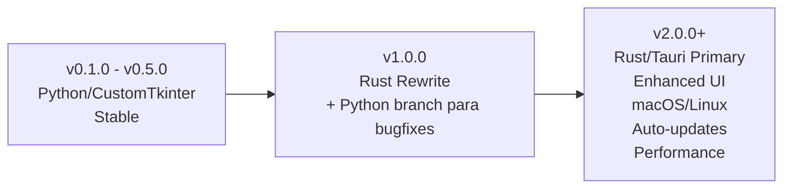

# Decisões de Arquitetura (ADRs)

Registro de decisões arquiteturais significativas — *Architecture Decision Records*.

---

## 🎯 O que são ADRs?

**ADR (Architecture Decision Record)** documenta uma decisão arquitetural importante, seu contexto, consequências e alternativas consideradas. Seguem o formato: **Título → Status → Contexto → Decisão → Consequências**.

---

## 📋 Índice de ADRs

| ID | Título | Status | Data |
|----|--------|--------|------|
| [0001](./0001-python-now-rust-tauri-future.md) | **Python Now, Rust/Tauri Future** | ✅ Accepted | 2026-04-17 |

---

## 📝 ADR 0001: Python Now, Rust/Tauri Future

### Resumo

> **Decisão**: Usar **Python + CustomTkinter** para o MVP (v0.1.0-beta), com plano de migração para **Rust + Tauri** no futuro se o projeto crescer.

### Contexto

- Projeto hobby / learning project (solo developer)
- Necessidade de MVP rápido (semanas, não meses)
- Python é linguagem de estudo principal
- Windows-only no MVP (Minecraft Bedrock paths)

### Decisão

=== "🐍 Python Agora (MVP)"

    **Vantagens:**
    * ✅ Prototipação rápida — TDD, iteração veloz
    * ✅ Fácil aprendizado — Reforça estudo principal
    * ✅ Ecossistema rico — Pydantic, pytest, PyInstaller
    * ✅ UI Desktop — CustomTkinter limpo, curva baixa
    * ✅ File I/O nativo — `pathlib`, `shutil`
    * ✅ Time-to-market — MVP em semanas

    **Trade-offs:**
    * ⚠️ Runtime mais lento
    * ⚠️ Executável maior (~5MB)
    * ⚠️ Distribuição manual
    * ⚠️ Windows-only (OK para MVP)

=== "🦀 Rust + Tauri (Futuro)"

    **Quando/Se o projeto crescer:**
    * ✅ Production-grade — Performance, confiabilidade, segurança
    * ✅ Distribuição melhor — Executável menor (~10MB), auto-update nativo
    * ✅ Investimento em aprendizado — Rust valioso, systems programming
    * ✅ Stack web moderna — Tauri + React/Vue
    * ✅ Cross-platform — macOS/Linux mais fácil
    * ✅ Ecossistema — Tokio, serde, etc.

    **Bloqueador para MVP:**
    * ❌ Curva de aprendizado íngreme
    * ❌ Desenvolvimento inicial mais lento

### Consequências

| Fase | Tecnologia | Status |
|------|------------|--------|
| v0.1.0 – v0.5.0 | Python + CustomTkinter | ✅ Estável |
| v1.0.0 (Rust) | Rewrite completo | 🔮 Futuro |
| v2.0.0+ | Rust/Tauri (Primary) | 🔮 Futuro |

### Caminho de Migração (Hipotético)



### Drivers da Decisão

1. **Solo Developer** — Velocidade importa, Python é mais rápido para codar
2. **Learning Goal** — Python é foco de estudo, Rust é investimento futuro
3. **Project Type** — MVP hobby, não sistema de produção (ainda)
4. **Time Constraint** — MVP deve sair em semanas, não meses

---

## 📋 Como Criar Novo ADR

```bash
# 1. Copie o template
cp docs/decisions/0001-python-now-rust-tauri-future.md docs/decisions/0002-nova-decisao.md

# 2. Edite com:
# - Título descritivo
# - Status: Proposed / Accepted / Superseded / Deprecated
# - Contexto: Por que essa decisão agora?
# - Decisão: O que foi decidido
# - Consequências: Prós/Contras, impactos
# - Alternativas consideradas
# - Referências
```

### Template Mínimo

```markdown
# ADR XXX: Título da Decisão

## Status
**Proposed** / **Accepted** / **Superseded** / **Deprecated**

## Contexto
[Descreva o problema e por que uma decisão é necessária AGORA]

## Decisão
[O que foi decidido - seja específico]

## Consequências

### Positivas
- [Benefício 1]
- [Benefício 2]

### Negativas / Riscos
- [Trade-off 1]
- [Trade-off 2]

## Alternativas Consideradas
1. [Alternativa 1] - Por que não escolhida
2. [Alternativa 2] - Por que não escolhida

## Referências
- [Link 1]
- [Link 2]
```

---

## 🔗 Referências

- [Documenting Architecture Decisions](https://cognitect.com/blog/2011/11/15/documenting-architecture-decisions) — Michael Nygard
- [ADR GitHub Organization](https://github.com/adr) — Templates e ferramentas
- [Markdown Architectural Decision Records](https://adr.github.io/madr/) — Formato MADR
