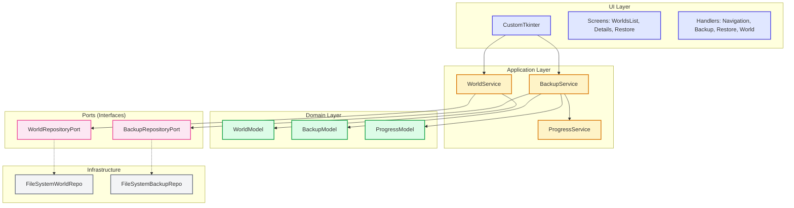

# Minecraft Bedrock Backup Manager

> **Gerenciador de backups de mundos Minecraft Bedrock Edition para Windows 10/11.**
> Interface gráfica nativa, backups versionados, restauração com preview.

[](https://github.com/DandanLeinad/minecraft-bedrock-backup-manager/releases/latest)
[](https://github.com/DandanLeinad/minecraft-bedrock-backup-manager/blob/main/LICENSE)
[](https://python.org)
[](https://microsoft.com/windows)

---

## 🎯 Por que usar?

<div class="grid cards" markdown>

-   :material-gamepad-variant:{ .lg .middle } **Para Jogadores**

    * **Zero configuração** — Detecta mundos automaticamente
    * **Backup em 1 clique** — Versionado com timestamp
    * **Restauração segura** — Preview do conteúdo antes de confirmar
    * **Portátil** — `.exe` único (~5MB), sem instalação

-   :material-code-braces:{ .lg .middle } **Para Desenvolvedores**

    * **Arquitetura Hexagonal** — Ports & Adapters, testável
    * **TDD rigoroso** — 149 testes, 100% models coverage
    * **Feature Flags** — Integração contínua segura
    * **Open Source** — AGPL-3.0, contribuições bem-vindas

</div>

---

## 🚀 Início Rápido

=== "🎮 Usuário Final"

    1. [Baixe o `.exe` mais recente](https://github.com/DandanLeinad/minecraft-bedrock-backup-manager/releases/latest) :material-download:
    2. Execute — **sem instalação necessária** :material-play-circle:
    3. Selecione um mundo → **Fazer Backup** :material-content-save:
    4. Pronto! Backups em `Documentos\MinecraftBackups\backups\` :material-folder:

    [](https://github.com/DandanLeinad/minecraft-bedrock-backup-manager/releases/latest)

=== "🛠️ Desenvolvedor"

    ```bash title="Setup completo"
    # Clone
    git clone https://github.com/DandanLeinad/minecraft-bedrock-backup-manager.git
    cd minecraft-bedrock-backup-manager

    # Instale uv (Windows PowerShell)
    irm https://astral.sh/uv/install.ps1 | iex

    # Setup do projeto
    uv sync --all-groups
    uv run task pre-commit-install

    # Rode a aplicação
    uv run task dev
    ```

    [Guia de Desenvolvimento →](./getting-started/usage.md){ .md-button }

---

## 📚 Documentação

<div class="grid cards" markdown>

-   :material-rocket-launch:{ .lg .middle } **Primeiros Passos (Dev)**

    Setup, comandos Taskipy, build, versionamento, workflow Git, feature flags.

    [:octicons-arrow-right-24: Ver Guia](./getting-started/usage.md)

-   :material-sitemap:{ .lg .middle } **Arquitetura**

    Ports & Adapters, Domain Models, Services, Dependency Injection, Patterns.

    [:octicons-arrow-right-24: Visão Geral](./architecture/overview.md)

-   :material-book-open-variant:{ .lg .middle } **Guia do Usuário**

    Instalação, primeiro backup, restauração, localização, configurações, FAQ, troubleshooting.

    [:octicons-arrow-right-24: Começar](./user-guide/index.md)

-   :material-api:{ .lg .middle } **Referência Técnica**

    Models (Pydantic), Ports (ABCs), Services, Configuração, Feature Flags.

    [:octicons-arrow-right-24: API Reference](./reference/index.md)

-   :material-lightbulb-on:{ .lg .middle } **Decisões (ADRs)**

    Registro de decisões arquiteturais: Python agora, Rust/Tauri futuro.

    [:octicons-arrow-right-24: Ver ADRs](./decisions/index.md)

-   :material-git:{ .lg .middle } **Desenvolvimento**

    Trunk-Based Development, branches curtas, feature flags, testing, CI/CD.

    [:octicons-arrow-right-24: Workflow](./development/trunk-based-development.md)

</div>

---

## 🏗️ Arquitetura em Resumo



---

## 🛠️ Stack Tecnológico

| Camada | Tecnologia | Versão |
|--------|------------|--------|
| **Linguagem** | Python | 3.14+ |
| **UI** | CustomTkinter | 5.2+ |
| **Validação** | Pydantic | 2.13+ |
| **Testes** | pytest / pytest-cov | 9+ |
| **Lint/Format** | Ruff | 0.15+ |
| **Types** | Pyright | 1.1+ |
| **Build** | PyInstaller | 6.21+ |
| **Versionamento** | Commitizen | 4.16+ |
| **Docs** | Zensical | 0.0.45+ |
| **Package Manager** | uv | 0.11+ |

---

## 🔗 Links Úteis

| Link | Descrição |
|------|-----------|
| [📦 Releases](https://github.com/DandanLeinad/minecraft-bedrock-backup-manager/releases) | Downloads `.exe` assinados |
| [🐛 Issues](https://github.com/DandanLeinad/minecraft-bedrock-backup-manager/issues) | Bug reports, feature requests |
| [💬 Discussions](https://github.com/DandanLeinad/minecraft-bedrock-backup-manager/discussions) | Perguntas, ideias, show & tell |
| [📝 Changelog](https://github.com/DandanLeinad/minecraft-bedrock-backup-manager/blob/main/CHANGELOG.md) | Histórico de versões |
| [🤝 Contributing](https://github.com/DandanLeinad/minecraft-bedrock-backup-manager/blob/main/CONTRIBUTING.md) | Como contribuir |

---

## ⚡ Feature Flags (Experimental)

Ative funcionalidades em desenvolvimento:

```bash title="Ativar feature flags"
# Auto-backup em background
FF_AUTO_BACKUP=true uv run task dev

# Preview antes de restaurar
FF_RESTORE_PREVIEW=true uv run task dev

# Múltiplas flags
FF_AUTO_BACKUP=true FF_CLOUD_SYNC=true FF_RESTORE_PREVIEW=true uv run task dev
```

!!! tip "Dica"
    Feature flags permitem integrar código incompleto na `main` sem quebrar produção.
    Veja [Feature Flags Guide](./development/feature-flags.md) para detalhes.

---

## 📄 Licença

**AGPL-3.0-or-later** — Código aberto, livre para usar, modificar e distribuir.
Consulte [LICENSE](https://github.com/DandanLeinad/minecraft-bedrock-backup-manager/blob/main/LICENSE) para detalhes.

---

*Feito com :heart: por [DandanLeinad](https://github.com/DandanLeinad) · Powered by [Zensical](https://zensical.org) · [Editar esta página](https://github.com/DandanLeinad/minecraft-bedrock-backup-manager/edit/main/docs/index.md)*
