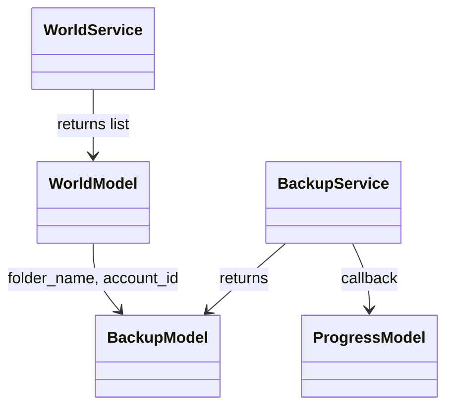

# Models — Pydantic Models

Modelos de domínio com validação automática, serialização e type hints.

---

## WorldModel

Representa um mundo Minecraft Bedrock detectado no sistema.

```python title="src/backup_manager_mvp/core/models/world_model.py"
class WorldModel(BaseModel):
    """Mundo Minecraft Bedrock detectado no sistema."""

    folder_name: str = Field(..., min_length=1, max_length=12)
        # Nome da pasta (base64 + padding =) — EX: "6LknJ3qXcJo="
        # Validação: exatamente 12 chars, termina com "="

    levelname: str = Field(..., min_length=1)
        # Nome exibido no jogo — lido de levelname.txt

    world_icon_path: Path | None = Field(default=None)
        # Caminho para world_icon.jpeg (pode não existir)

    path: Path = Field(...)
        # Caminho completo da pasta do mundo
        # Validação: não None, não vazio, não "."

    account_id: str = Field(..., min_length=1)
        # UUID da conta Microsoft ou "UWP-Store" / "Shared"
        # Validação: não apenas whitespace

    version: list[int] = Field(..., min_length=5, max_length=5)
        # lastOpenedWithVersion — 5 inteiros não-negativos
        # EX: [1, 26, 12, 2, 0]
```

### Validações

| Campo | Regra |
|-------|-------|
| `folder_name` | 12 chars + termina com `=` |
| `path` | Não vazio, não `.` |
| `levelname` | Não apenas whitespace |
| `account_id` | Não apenas whitespace |
| `version` | Lista de 5 ints ≥ 0 |

### Exemplo de Uso

```python
world = WorldModel(
    folder_name="6LknJ3qXcJo=",
    levelname="Meu Mundo Sobrevivência",
    world_icon_path=Path("C:/.../world_icon.jpeg"),
    path=Path("C:/Users/.../minecraftWorlds/6LknJ3qXcJo="),
    account_id="a1b2c3d4-e5f6-7890-abcd-ef1234567890",
    version=[1, 26, 12, 2, 0],
)
```

---

## BackupModel

Representa um backup de um mundo.

```python title="src/backup_manager_mvp/core/models/backup_model.py"
class BackupModel(BaseModel):
    """Backup de um mundo."""

    world_folder_name: str = Field(..., min_length=1)
        # Referência ao WorldModel.folder_name (UUID Bedrock)
        # Permite encontrar backups mesmo se mundo renomeado

    world_account_id: str = Field(..., min_length=1)
        # Referência ao WorldModel.account_id

    created_at: datetime = Field(...)
        # Timestamp da criação do backup

    backup_path: Path = Field(...)
        # Caminho completo da pasta de backup
        # Estrutura: backup_base / folder_name / YYYY-MM-DD_HH-MM-SS
```

### Properties

```python
@property
def name(self) -> str:
    """Nome do diretório (timestamp)."""
    return self.backup_path.name

@property
def size_display(self) -> str:
    """Tamanho legível: B, KB, MB, GB."""
    # Calcula recursivo via rglob
```

### Exemplo de Uso

```python
backup = BackupModel(
    world_folder_name="6LknJ3qXcJo=",
    world_account_id="a1b2c3d4-e5f6-7890-abcd-ef1234567890",
    created_at=datetime(2026, 6, 19, 14, 30, 0),
    backup_path=Path("C:/Users/.../MinecraftBackups/backups/6LknJ3qXcJo=/2026-06-19_14-30-00"),
)

print(backup.name)        # "2026-06-19_14-30-00"
print(backup.size_display) # "12.5 MB"
```

---

## ProgressModel

Progresso de operação longa (backup/restore).

```python title="src/backup_manager_mvp/core/models/progress_model.py"
class ProgressModel(BaseModel):
    """Progresso de operação longa (backup/restore)."""

    current: int = Field(ge=0)
        # Itens processados até agora

    total: int = Field(ge=1)
        # Total de itens esperados

    stage: str = Field(...)
        # Descrição da fase: "Preparando...", "Copiando arquivos...", "Concluído"
```

### Exemplo de Callback

```python
def progress_callback(progress: ProgressModel) -> None:
    percent = (progress.current / progress.total) * 100
    print(f"[{percent:.1f}%] {progress.stage}")

# Uso no BackupService
backup_service.create_backup(world, progress_callback=progress_callback)
```

---

## Diagrama de Relacionamento



---

## Referências

- [Código: world_model.py](../../src/backup_manager_mvp/core/models/world_model.py)
- [Código: backup_model.py](../../src/backup_manager_mvp/core/models/backup_model.py)
- [Código: progress_model.py](../../src/backup_manager_mvp/core/models/progress_model.py)
- [Ports](./ports.md) — Interfaces que usam estes models
- [Services](./services.md) — Lógica que manipula estes models
