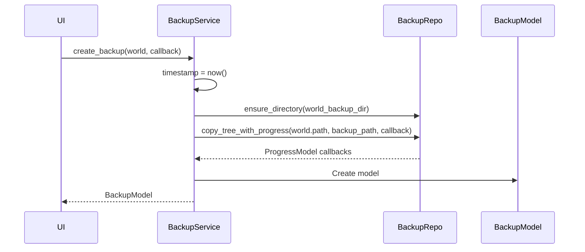
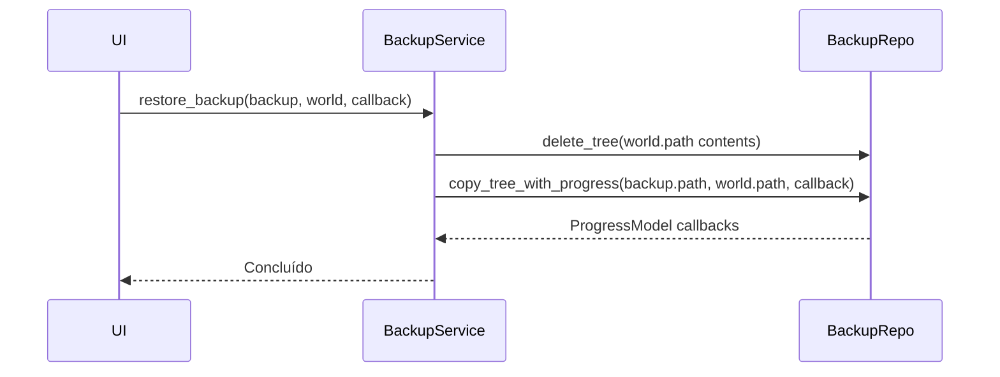

# Services — Lógica de Negócio

Serviços de aplicação que orquestram Models e Ports. Sem dependência de UI ou FS concreto.

---

## WorldService

Descoberta e metadados de mundos Minecraft Bedrock.

```python title="src/backup_manager_mvp/core/services/world_service.py"
class WorldService:
    """Serviço para operações relacionadas a mundos Minecraft Bedrock."""

    def __init__(self, repository: WorldRepositoryPort):
        """Inicializa com implementação de repositório de mundos."""
        self.repository = repository
```

### Métodos Principais

| Método | Retorno | Descrição |
|--------|---------|-----------|
| `list_worlds()` | `list[WorldModel]` | Todos os mundos (3 fontes) |
| `get_worlds_base_path()` | `Path` | Caminho base AppData |
| `get_uwp_store_path()` | `Path` | Caminho UWP Store |
| `get_shared_path()` | `Path` | Caminho Shared |
| `list_account_ids()` | `list[str]` | Account IDs encontrados |
| `get_world_levelname(path)` | `str` | Lê levelname.txt |
| `get_world_icon_path(path)` | `Path` | Caminho world_icon.jpeg |
| `get_world_metadata(world, backup_service?)` | `dict` | Size, backups count, last backup |

### Fontes de Mundos (3)

```mermaid
flowchart TD
    WS[WorldService.list_worlds()]
    WS --> NORMAL["Contas Normais\n%AppData%\...\Users\{id}\games\com.mojang\minecraftWorlds\"]
    WS --> UWP["UWP Store\n%LocalAppData%\Packages\Microsoft.MinecraftUWP_...\minecraftWorlds\"]
    WS --> SHARED["Shared\n%AppData%\...\Users\Shared\games\com.mojang\minecraftWorlds\"]
```

### Fluxo: list_worlds()

```python
def list_worlds(self) -> list[WorldModel]:
    all_worlds = []

    # 1. Contas normais
    for account_id in self.list_account_ids():
        worlds_dir = self.get_worlds_base_path() / account_id / "games" / "com.mojang" / "minecraftWorlds"
        all_worlds.extend(self._list_worlds_from_path(worlds_dir, account_id))

    # 2. UWP Store
    all_worlds.extend(self._list_worlds_from_path(self.get_uwp_store_path(), "UWP-Store"))

    # 3. Shared
    all_worlds.extend(self._list_worlds_from_path(self.get_shared_path(), "Shared"))

    return all_worlds
```

### Metadados do Mundo

```python
metadata = world_service.get_world_metadata(world, backup_service)
# {
#     "size": "12.5 MB",
#     "backups_count": "3",
#     "last_backup": "2h ago"
# }
```

---

## BackupService

Criação, listagem, restauração e preview de backups.

```python title="src/backup_manager_mvp/core/services/backup_service.py"
class BackupService:
    """Serviço para operações de backup e restauração."""

    def __init__(self, repository: BackupRepositoryPort):
        self.repository = repository
```

### Métodos Principais

| Método | Retorno | Descrição |
|--------|---------|-----------|
| `create_backup(world, progress_callback?)` | `BackupModel` | Cria backup com progresso |
| `list_backups(world)` | `list[BackupModel]` | Backups ordenados (recente → antigo) |
| `restore_backup(backup, world, progress_callback?)` | `None` | Restaura backup (destrutivo) |
| `get_backup_preview_info(backup)` | `dict` | Preview: files, dirs, size, top items |
| `get_backup_base_path()` | `Path` | Base de backups |

### Fluxo: create_backup()



### Fluxo: restore_backup()



### Preview de Backup

```python
preview = backup_service.get_backup_preview_info(backup)
# {
#     "total_files": 1250,
#     "total_dirs": 340,
#     "total_size": 13107200,
#     "top_level_items": [
#         {"name": "levelname.txt", "type": "file", "size": 24},
#         {"name": "db", "type": "dir", "size": 0},
#         ...
#     ],
#     "error": None
# }
```

---

## ProgressService

Gerenciamento de callbacks de progresso para UI.

```python title="src/backup_manager_mvp/core/services/progress_service.py"
class ProgressService:
    """Gerencia callbacks de progresso para operações longas."""

    def __init__(self):
        self._callbacks: list[Callable[[ProgressModel], None]] = []

    def subscribe(self, callback: Callable[[ProgressModel], None]) -> None:
        """Registra callback para receber updates."""
        self._callbacks.append(callback)

    def unsubscribe(self, callback: Callable[[ProgressModel], None]) -> None:
        """Remove callback."""
        self._callbacks.remove(callback)

    def emit(self, progress: ProgressModel) -> None:
        """Emite progresso para todos os callbacks."""
        for cb in self._callbacks:
            cb(progress)
```

### Uso na UI

```python
# Na tela de backup/restore
progress_service = ProgressService()

def on_progress(progress: ProgressModel):
    progress_bar.value = progress.current / progress.total
    status_label.text = progress.stage

progress_service.subscribe(on_progress)

# Passar para service
backup_service.create_backup(world, progress_callback=progress_service.emit)
```

---

## Tabela Resumo

| Service | Port(s) Usados | Models Retornados |
|---------|----------------|-------------------|
| `WorldService` | `WorldRepositoryPort` | `list[WorldModel]` |
| `BackupService` | `BackupRepositoryPort` | `BackupModel`, `list[BackupModel]` |
| `ProgressService` | — | `ProgressModel` (via callback) |

---

## Referências

- [Código: world_service.py](../../src/backup_manager_mvp/core/services/world_service.py)
- [Código: backup_service.py](../../src/backup_manager_mvp/core/services/backup_service.py)
- [Código: progress_service.py](../../src/backup_manager_mvp/core/services/progress_service.py)
- [Ports](./ports.md) — Interfaces consumidas
- [Models](./models.md) — Models manipulados
