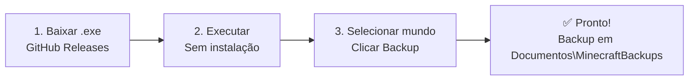

# Guia do Usuário

Tudo que você precisa saber para usar o Minecraft Bedrock Backup Manager.

---

## 🎯 Visão Geral

O **Minecraft Bedrock Backup Manager** é uma ferramenta gratuita e open source para fazer backup e restaurar seus mundos do Minecraft Bedrock Edition no Windows.

-   :material-download:{ .lg .middle } **Instalação**

    Baixe, requisitos, antivírus, primeiro uso.

    [:octicons-arrow-right-24: Ver →](installation.md)

-   :material-content-save:{ .lg .middle } **Primeiro Backup**

    Passo a passo: detectar mundos, selecionar, fazer backup.

    [:octicons-arrow-right-24: Ver →](first-backup.md)

-   :material-restore:{ .lg .middle } **Restaurar Mundo**

    Como restaurar, preview, cuidados, backup automático antes.

    [:octicons-arrow-right-24: Ver →](restore.md)

-   :material-folder:{ .lg .middle } **Onde Ficam os Backups**

    Localização, estrutura de pastas, como acessar.

    [:octicons-arrow-right-24: Ver →](backup-location.md)

-   :material-cog:{ .lg .middle } **Configurações**

    Feature flags, logs, caminhos personalizados (futuro).

    [:octicons-arrow-right-24: Ver →](settings.md)

-   :material-help-circle:{ .lg .middle } **FAQ**

    Perguntas frequentes sobre uso, mundos, backups.

    [:octicons-arrow-right-24: Ver →](faq.md)

-   :material-alert-circle:{ .lg .middle } **Troubleshooting**

    Erros comuns, logs, permissões, antivírus.

    [:octicons-arrow-right-24: Ver →](troubleshooting.md)

---

## ⚡ Início Rápido (3 Passos)

1.  **[Baixe o `.exe` mais recente](https://github.com/DandanLeinad/minecraft-bedrock-backup-manager/releases/latest)**
2.  Execute o arquivo — **não precisa instalar**
3.  Selecione seu mundo na lista → clique em **"Fazer Backup"**

---

## 🎮 O que o App Faz

| Funcionalidade | Descrição |
|----------------|-----------|
| **Detecção Automática** | Encontra mundos em contas Microsoft, UWP Store e Shared |
| **Backup Versionado** | Cada backup tem timestamp: `YYYY-MM-DD_HH-MM-SS` |
| **Restauração Segura** | Preview do conteúdo antes de confirmar |
| **Interface Nativa** | CustomTkinter — leve, responsiva, tema claro/escuro |
| **Portátil** | `.exe` único (~5MB), roda em qualquer Windows 10/11 |

---

## 🖥️ Requisitos

- **Windows 10 ou 11** (64-bit)
- **Minecraft Bedrock Edition** instalado (Microsoft Store ou launcher)
- **Permissão de leitura** nas pastas do Minecraft (`%AppData%`, `%LocalAppData%`)
- **Permissão de escrita** em `Documentos\MinecraftBackups\`

---

## 🔗 Links Úteis

| Link | Descrição |
|------|-----------|
| [📦 Releases](https://github.com/DandanLeinad/minecraft-bedrock-backup-manager/releases) | Downloads mais recentes |
| [🐛 Reportar Bug](https://github.com/DandanLeinad/minecraft-bedrock-backup-manager/issues) | Encontrou um problema? |
| [💬 Discussões](https://github.com/DandanLeinad/minecraft-bedrock-backup-manager/discussions) | Dúvidas, sugestões |
| [📝 Changelog](https://github.com/DandanLeinad/minecraft-bedrock-backup-manager/blob/main/CHANGELOG.md) | O que mudou em cada versão |

---

!!! tip "Dica"
    O app **não modifica** seus mundos originais ao fazer backup — apenas copia os arquivos.
    A restauração **sobrescreve** o mundo atual, então faça um backup antes se estiver em dúvida!

---

*Precisa de ajuda técnica? Veja [Desenvolvimento](../development/index.md) ou [Arquitetura](../architecture/overview.md).*
