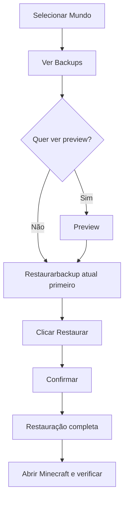

# Restaurar Mundo

Como restaurar um backup — com preview, confirmação e cuidados.

---

## ⚠️ Importante: Leia Antes

!!! danger "Operação Destrutiva"
    **Restaurar sobrescreve o mundo atual** — o conteúdo atual da pasta do mundo será **permanentemente substituído** pelo conteúdo do backup.

    *   Faça um **backup do estado atual** antes de restaurar (se o mundo tem progresso novo)
    *   Não há "desfazer" após confirmar
    *   O backup original **não é alterado** — pode restaurar quantas vezes quiser

---

## 📋 Passo a Passo

### 1. Selecione o Mundo

Na lista lateral, clique no mundo que deseja restaurar.

### 2. Veja os Backups Disponíveis

No painel direito, a lista mostra todos os backups daquele mundo:

| Coluna | Info |
|--------|------|
| **Data** | Timestamp do backup (`YYYY-MM-DD HH:MM:SS`) |
| **Tamanho** | Tamanho total do backup |
| **Ações** | Botões: Preview / Restaurar |

### 3. Preview (Recomendado) — `FF_RESTORE_PREVIEW=true`

Clique em **:material-eye: Preview** para ver o conteúdo **antes** de restaurar:

=== "O que o Preview Mostra"
    *   Total de arquivos e pastas
    *   Tamanho total
    *   Itens do nível superior (primeiras pastas/arquivos)
    *   Ex: `levelname.txt`, `db/`, `structures/`, `world_icon.jpeg`

=== "Por que Usar"
    *   Confirma se é o backup correto
    *   Verifica se não está corrompido
    *   Evita restaurar backup errado

> **Nota**: Preview requer a feature flag `FF_RESTORE_PREVIEW=true` ativada.

### 4. Restaurar

Clique em **:material-restore: Restaurar** → Confirmação → **Sim, restaurar**.

=== "Durante a Restauração"
    *   Barra de progresso: "Limpando mundo atual...", "Restaurando arquivos..."
    *   Interface travada até concluir
    *   Toast de sucesso: "Mundo restaurado com sucesso!"

=== "Após Restaurar"
    *   Abra o Minecraft Bedrock
    *   O mundo estará no estado do backup
    *   Progresso pós-backup será perdido

---

## 🔄 Fluxo Recomendado



---

## 💡 Dicas

| Situação | Recomendação |
|----------|--------------|
| **Mundo corrompido** | Restaure backup mais recente que funcionava |
| **Deletei algo sem querer** | Backup antes da deleção → Preview → Restaurar |
| **Testando mods/texture packs** | Backup antes → Teste → Se der ruim, restaure |
| **Mudança de versão do Minecraft** | Backup antes de atualizar o jogo |

---

## 🔧 Feature Flags Relacionadas

```bash
# Ativar preview de restauração
FF_RESTORE_PREVIEW=true uv run task dev

# Logs detalhados durante restauração
FF_ADVANCED_LOGGING=true uv run task dev
```

---

## ❌ Erros Comuns

| Erro | Causa | Solução |
|------|-------|---------|
| "Backup not found" | Pasta do backup foi deletada manualmente | Verifique `Documentos\MinecraftBackups\backups\` |
| "World not found" | Mundo foi movido/deletado fora do app | Re-detecte mundos (reinicie app) |
| "Permission denied" | Antivírus bloqueando / pasta só leitura | Desative AV temporariamente / verifique permissões |
| "Backup corrompido" | Cópia incompleta anterior | Tente backup anterior |

---

## 🔗 Próximos Passos

- [Onde Ficam os Backups →](./backup-location.md)
- [FAQ →](./faq.md)
- [Troubleshooting →](./troubleshooting.md)
